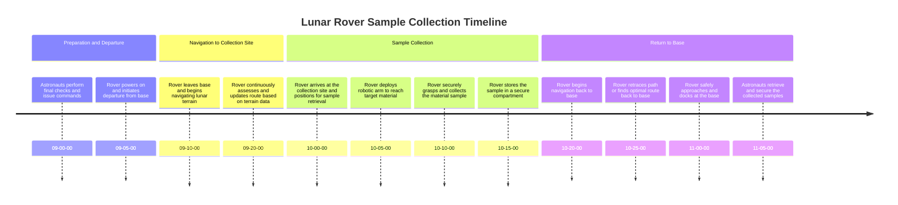

```mermaid
timeline
    title Lunar Rover Sample Collection Timeline
    section Preparation and Departure
      Astronauts perform final checks and issue commands:  09-00-00
      Rover powers on and initiates departure from base: 09-05-00
    section Navigation to Collection Site
      Rover leaves base and begins navigating lunar terrain: 09-10-00
      Rover continuously assesses and updates route based on terrain data: 09-20-00
    section Sample Collection
      Rover arrives at the collection site and positions for sample retrieval: 10-00-00
      Rover deploys robotic arm to reach target material: 10-05-00
      Rover securely grasps and collects the material sample: 10-10-00
      Rover stores the sample in a secure compartment: 10-15-00
    section Return to Base
      Rover begins navigation back to base: 10-20-00
      Rover retraces path or finds optimal route back to base: 10-25-00
      Rover safely approaches and docks at the base: 11-00-00
      Astronauts retrieve and secure the collected samples: 11-05-00


```