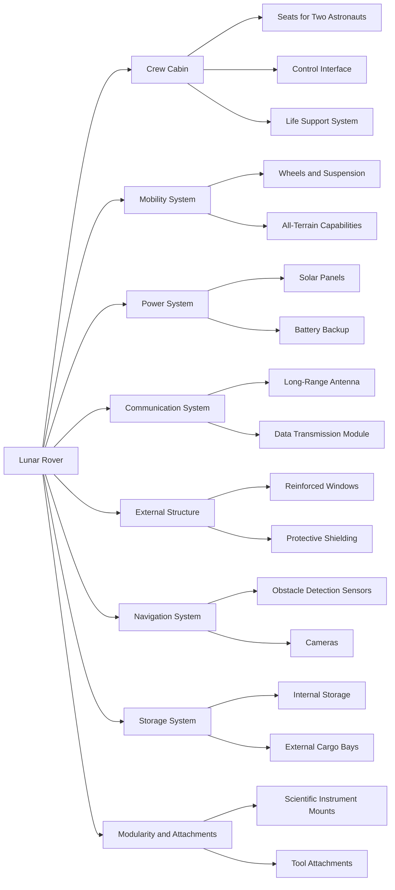

# Requirements
1. **Crew Capacity**: The rover should accommodate two astronauts in an enclosed, pressurized cabin.
2. **Mobility**: Design for all-terrain mobility, capable of navigating rocky, uneven surfaces and steep inclines.
3. **Visibility**: Large, reinforced windows with a wide field of view for the crew, particularly in the front and sides.
4. **Modularity**: The rover should have attachment points for various scientific instruments, tools, and cargo.
5. **Power Supply**: Integrated solar panels or other renewable energy sources with backup batteries.
6. **Communication**: One antenna or communication dish that allows for long-range communication with a lunar base or Earth.
7. **Durability**: The exterior must be resistant to lunar dust and extreme temperatures, with protective shielding as needed.
8. **Accessibility**: Easy access to the rover from the exterior, with ladders or steps and a docking port for lunar suits.
9. **Storage**: Internal and external storage compartments for tools, samples, and emergency supplies.
10. **Navigation**: Integrated navigation system with exterior sensors and cameras for obstacle detection and mapping.

# Architecture

